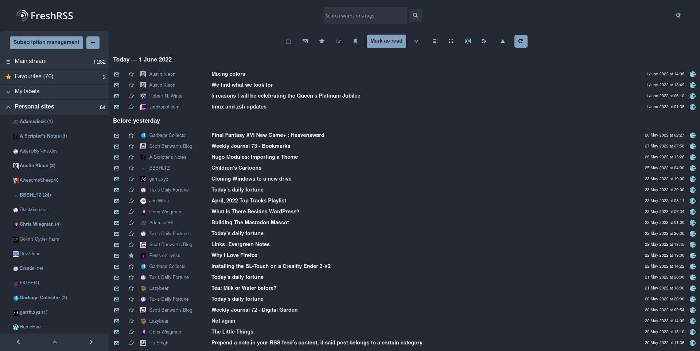

# FreshRSS-Nord-Theme

A simple theme based on Nord's color scheme for [FreshRSS](https://freshrss.org)

1. Custom ```base.css``` file with colors, backgrounds and borders
2. Change information in ```metadata.json``` file (at least, give a name!)
3. Choose your new theme in FreshRSS configuration
4. Enjoy your wonderful theme!




